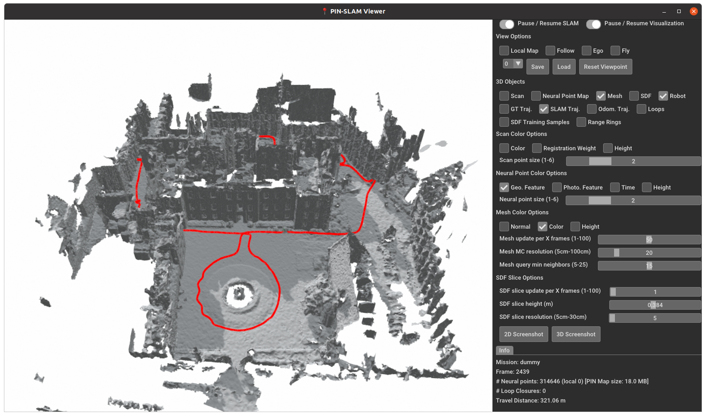
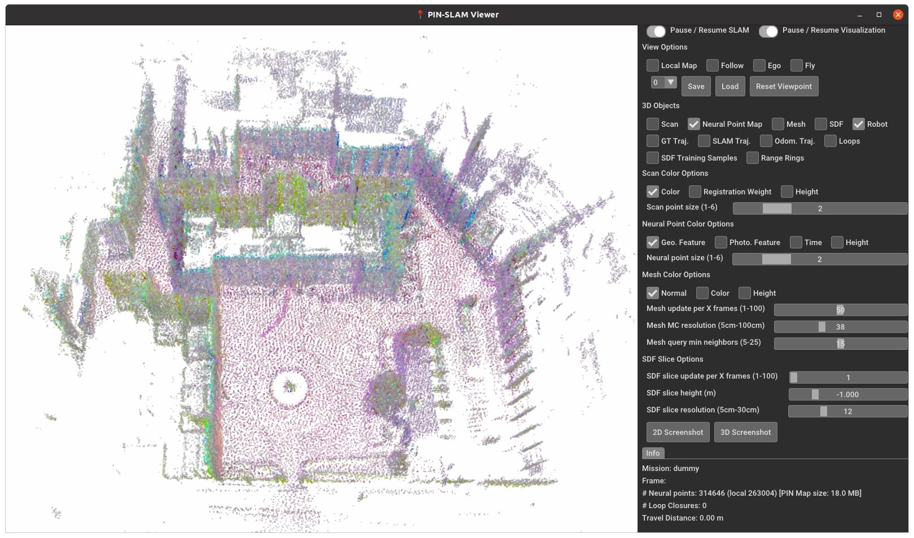
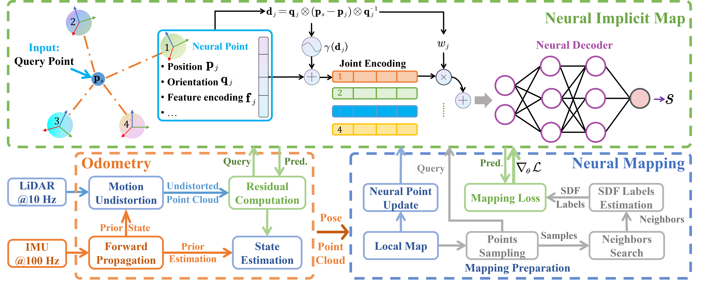

<p align="center">
  <h1 align="center">⚔️CLID-SLAM: A Coupled LiDAR-Inertial Neural Implicit Dense SLAM with Region-Specific SDF Estimation</h1>
  <p align="center">
    <a href="https://github.com/DUTRobot/CLID-SLAM/releases"></a>
    <a href="https://ieeexplore.ieee.org/abstract/document/10884955"></a>
    <a href="https://github.com/DUTRobot/CLID-SLAM"></a>
    <a href="https://github.com/DUTRobot/CLID-SLAM"></a>
    <a href="https://github.com/DUTRobot/CLID-SLAM/blob/main/LICENSE"></a>
    <a href="https://github.com/DUTRobot/CLID-SLAM/stargazers"></a>
    <a href="https://github.com/DUTRobot/CLID-SLAM/network/members"></a>
    <a href="https://github.com/DUTRobot/CLID-SLAM/issues"></a>
    </p>
</p>

| Mesh                          | Neural Points                     |
|-------------------------------|-----------------------------------|
|  |  |

## TODO 📝

- [x] Release the source code
- [ ] Enhance the README.md
- [ ] Include the theory derivations
## Pipeline

<div style="background-color:white; display:inline-block;">
  
</div>

## Installation

### Platform Requirements
- Ubuntu 20.04
- GPU (tested on RTX 4090)

### Steps

```bash
# Install Miniforge3
wget -O Miniforge3.sh "https://github.com/conda-forge/miniforge/releases/latest/download/Miniforge3-$(uname)-$(uname -m).sh"
bash Miniforge3-$(uname)-$(uname -m).sh
# Clone the repo
git clone git@github.com:DUTRobot/CLID-SLAM.git
cd CLID-SLAM
# create conda environment
mamba create -n ros_env python=3.11
# Install ROS noetic
mamba install ros-noetic-desktop-full -c robostack-noetic -c conda-forge
# install pytorch
pip3 install torch torchvision torchaudio --index-url https://download.pytorch.org/whl/cu126
pip3 install -r requirements.txt
```

## Data Preparation

### Download ROSbag Files
- [**Newer College Dataset**](https://ori-drs.github.io/newer-college-dataset/) 
(also available on [Baidu Disk](https://pan.baidu.com/s/1yR92s4UGcphmGIqjo8pPCw?pwd=rrdf) due to Google Drive's maximum file size limit).

- [**SubT-MRS Dataset**](https://superodometry.com/iccv23_challenge_LiI)

### Convert to Sequences
- Edit `./dataset/converter/config/rosbag2dataset.yaml`.

  ```yaml
  input_bag: '/home/jiang/hku1_converted.bag'
  output_folder: './dataset/hku/'
  imu_topic: '/livox/imu'
  lidar_topic: '/livox/pointcloud2'
  image_topic: "/left_camera/image/compressed"  # or /camera/color/image_raw
  batch_size: 100 # Number of messages per batch
  end_frame: -1 # -1 means process the entire bag file
  ```

- Run:
  ```bash
  python3 ./dataset/converter/rosbag2dataset_parallel.py
  ```

## Run CLID-SLAM
```bash
python3 slam.py ./config/run_ncd128.yaml
```
## Acknowledgements 🙏

This project builds on [**PIN-SLAM**](https://github.com/PRBonn/PIN_SLAM) by [**PRBonn/YuePanEdward**](https://github.com/YuePanEdward). We gratefully acknowledge their valuable contributions.
